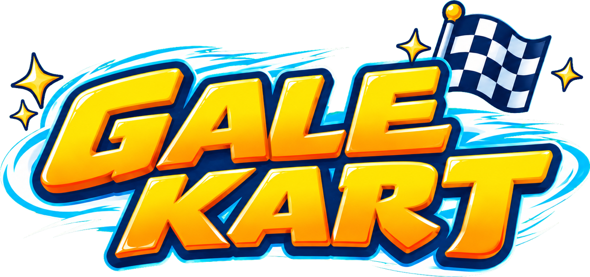

<p align="center">
  <a href="README.md"></a>
  <a href="README.zh-CN.md"></a>
</p>

<p align="center">
  
</p>

<p align="center">
  A KartRider-inspired 3D kart racer made with Godot 4.7 — drifting, boost gauge, nitro, instant boost, start boost, drafting, big jumps, item battles and TV-style replays.
</p>

> [!IMPORTANT]
> **This game was made entirely by Claude Opus 5.5.** Every line of code, the tracks and scenery, gameplay and handling tuning, the UI, the synthesized sound effects and music, the tests and the builds were produced by Anthropic's Claude Opus 5.5 working in Claude Code.
>
> **All image assets were generated by Opus 5.5 calling OpenAI GPT Image (gpt-image-2.5).** This covers the logo, app icon, item icons, trophies, track illustrations, home screen art, menu backgrounds and trackside billboards.
>
> Direction, playtesting and feedback: **bilibili @铂金小鸟**. The 3D models (Kenney) and fonts are open-source assets; see [License & credits](#license--credits).

<p align="center">
  
</p>

## Play

- **Download (no Godot needed):** get the macOS build (universal: Intel and Apple Silicon) or the Windows build from the GitHub **Releases** page. You can also export your own build; see [Development](#development).
- **Run from source:** install Godot 4.7 (`brew install --cask godot`), then double-click `开始游戏.command`, run `godot --path .` in a terminal, or open the project in the Godot editor and press F5.
- **First launch:** on first launch, each computer compiles its 3D shaders (about 40 seconds on an Intel Mac). A "Preparing 3D graphics" screen is shown during this step, and later launches are fast.
- **Language:** the game is in Chinese and English. Simplified Chinese systems start in Chinese and all others start in English. You can change it any time in Settings.

## Features

- **4 modes:**
  - Speed Race: drift, fill the gauge, fire nitro.
  - Item Race: 10 items.
  - Time Trial: your best run is saved as a ghost, with a live gap.
  - Grand Prix: Rising Star Cup and Gale Cup, 4 races each, points-based.
- **8 tracks** from easy to hard (see below).
  - Forest Hairpin has an unguarded cliff road: fall off and you have to take the path below back to the main road. It also has a summit shortcut.
- **Karts and drivers:**
  - 5 karts, each with different Speed, Accel, Turn, Drift, Nitro and Weight.
  - 12 drivers and 5 paint jobs.
- **Opponents:** 7 AI rivals on Easy, Normal or Hard, over 1, 3 or 5 laps.
- **Items:** Nitro, Missile, Water Bomb, Banana, Angel Shield, Storm Cloud, Magnet, Thunder, UFO, Water Fly. Items are weighted by race position.
- **Full game flow:** title → main menu → race setup → loading → opening flyover → countdown → race → finish → 3D podium → replay, rematch or next track.
  - Race setup has a live 3D garage preview, driver portraits and track cards.
  - Also includes a pause menu, best records, controls help and an item guide.
  - Settings cover volume, graphics, fullscreen, V-Sync, camera, auto instant boost, FPS display and language.
- **8 themed worlds:**
  - Windmill village, colorful town, desert pyramids, snowy pines, giant mushroom forest, river gorge with waterfalls, racing circuit, neon city.
  - Hairpin warning signs line the tight corners.
  - Weather effects: falling leaves, sand, snow and fireflies.
- **Effects:**
  - Drift smoke and skid marks; white-to-blue drift sparks that tell you an instant boost is ready.
  - Nitro flames, draft wind lines and explosion shockwaves.
  - Status effects for shield, water bubble, UFO and cloud.
  - Speed lines and nitro radial blur.
- **Replays:**
  - TV, chase, orbit and top-down cameras with an auto director.
  - Variable speed, pause, focus switching and a hide-UI key, made for recording videos.
- **Audio:** all sound effects and 10 music tracks (one per track, plus menu and results) are synthesized offline.

## Tracks

| | | | |
|:---:|:---:|:---:|:---:|
| <br>**Sunny Village** ★ | <br>**Town Fingers** ★★ | <br>**Golden Dunes** ★★ | <br>**Frosty Park** ★★ |
| <br>**Forest Hairpin** ★★★ | <br>**Timber Gorge** ★★ | <br>**Gale Circuit** ★★ | <br>**Neon Night** ★★★ |

- **Sunny Village:** a wide loop among windmills and red-roofed cottages — perfect for drift practice.
- **Town Fingers:** town streets that fold back and forth like fingers — back-to-back hairpins test your drifting.
- **Golden Dunes:** rolling dunes past the pyramids, with two jumps to fly over.
- **Frosty Park:** an icy track through snowy pines — less grip, longer slides.
- **Forest Hairpin:** narrow dirt roads through a mushroom forest: six tight hairpins, an unguarded cliff road (fall off and take the path below), a muddy valley, an underpass and a summit shortcut.
- **Timber Gorge:** a mountain road past giant trees and cliffs, with a big jump over the river.
- **Gale Circuit:** a real racing circuit at sunset — two long straights and a hairpin.
- **Neon Night:** a figure-8 overpass among neon towers — narrow, twisty and all about racing lines.

Rising Star Cup: Sunny Village, Town Fingers, Golden Dunes, Frosty Park. Gale Cup: Forest Hairpin, Gale Circuit, Timber Gorge, Neon Night.

## Controls

| Action | Keyboard | Gamepad |
|---|---|---|
| Accelerate / brake & reverse | ↑ ↓ or W S | RT / LT |
| Steer | ← → or A D | Left stick / D-pad |
| Drift | Shift or J | B / RB / LB |
| Nitro / use item | Space or K | A |
| Swap items | Q or E | X |
| Respawn | R | Y |
| Change camera | C | Back |
| Pause | Esc or P | Start |
| Hide HUD | H | — |
| Mute | M | — |
| Fullscreen | F11 | — |

Tips:
- **Instant boost:** drift for more than 0.35 s, then release Shift. When "↑" appears, let go of ↑ and press it again. You can turn on "Auto Instant Boost" in Settings.
- **Start boost:** press ↑ for the first time within 0.35 s before GO, or within 0.3 s after it. Pressing too early in the last second makes you spin out.
- **Draft:** stay right behind another kart (3–14 m) for about 1 s to get a draft boost.

Replay controls: 1–4 switch cameras (0 for auto director), ← → switch focus kart, Space pauses, [ ] change speed, H hides the UI, Esc exits.

## Development

```bash
godot --headless --path . --import                 # first-time asset import
godot --headless --path . -s tests/run_tests.gd    # all automated tests (exit code = failure count)
godot --headless --path . -s tests/tools/sim_race.gd -- --track=all --mode=speed   # headless full AI races
godot --headless --path . -s tests/tools/handling.gd      # handling numbers for every kart
godot --headless --path . -s tests/tools/keyboard_bot.gd  # a simulated keyboard player drives every track
python3 tools/gen_audio.py                                # re-synthesize all sound effects and music

# Debug / screenshots / demos: start a driverless race and take timed screenshots
# (add --then-replay to go straight into the replay after the finish)
godot --path . --fixed-fps 60 -- --race=forest --mode=item --autopilot --shots=5,20 --out=/tmp/shots --quit-after=21 --size=1920x1080
# Screenshot a menu page, or run a scripted flow (smoke / pause / gp)
godot --path . -- --menu=setup --shots=2 --out=/tmp/shots --quit-after=3
godot --path . -- --flow=gp
godot --path . --fixed-fps 60 -s tests/tools/fx_gallery.gd -- --out=/tmp/fx   # effects gallery

# Export (install the 4.7.2 export templates first; don't use --headless, or shaders won't be pre-baked)
godot --path . --export-release "macOS" build/macos/GaleKart.zip
godot --path . --export-release "Windows" build/windows/GaleKart.exe
```

Project layout:
- `src/sim/`: a render-independent simulation (fixed 120 Hz substeps, runs headless).
- `src/view/`: the 3D presentation.
- `src/race/`: race control, event dispatch and replays.
- `src/ui/`: HUD and menus.
- `src/i18n/`: Chinese / English text.
- `src/autoload/`: game flow, saves and audio.

The design doc is `docs/superpowers/specs/2026-09-26-gale-kart-godot-design.md`.

## License & credits

- **Code:** MIT, see [`LICENSE`](LICENSE).
- **Image assets** (logo, icons, illustrations, backgrounds, billboards): generated by Claude Opus 5.5 with OpenAI GPT Image, then keyed and composited with the scripts in `tools/`.
- **3D models:** [Kenney](https://kenney.nl) (CC0), see `assets/models/LICENSE-Kenney.txt`.
- **Fonts:** ZCOOL KuaiLe and Bungee (SIL OFL 1.1), see `assets/fonts/`.
- **Sound effects and music:** synthesized offline by `tools/gen_audio.py`.
- **Not covered by the MIT license:** the author's avatar and personal promotion artwork (`assets/ui/creator/`, `assets/textures/ads/*creator*`).
