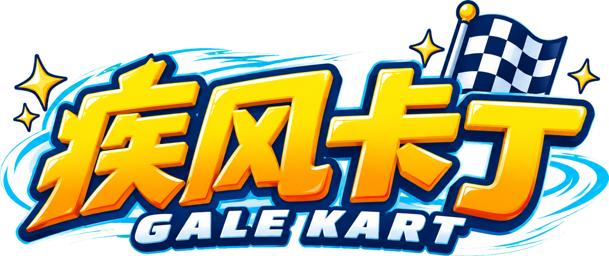
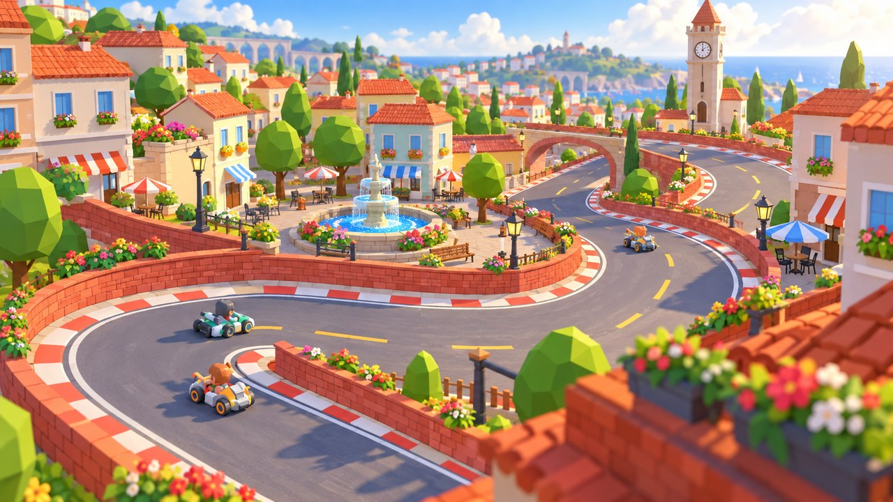
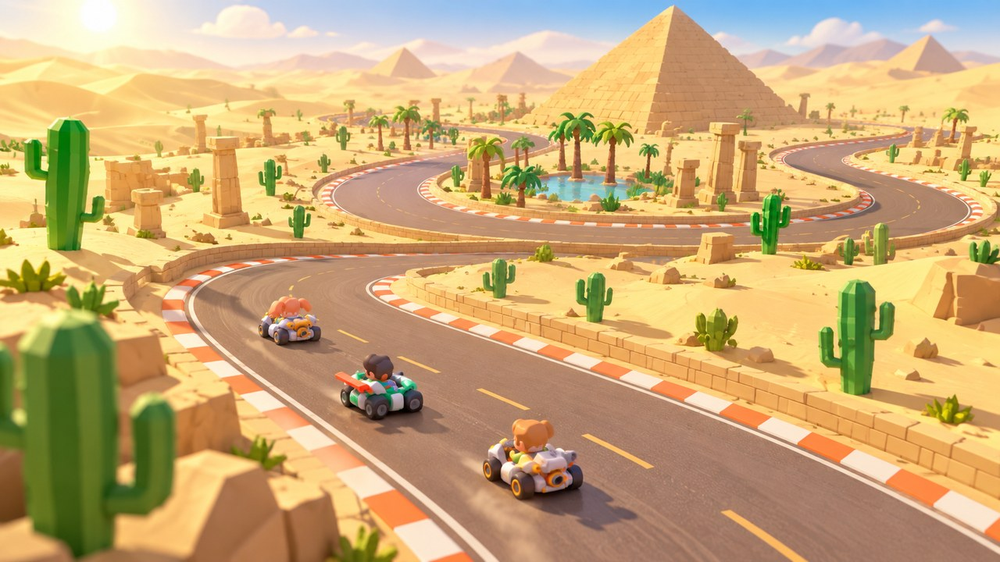
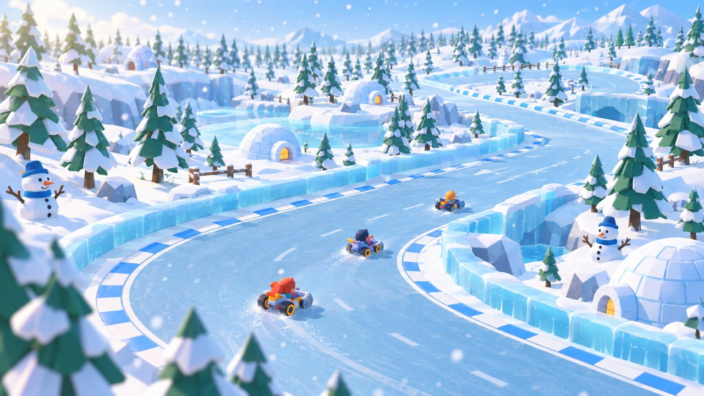
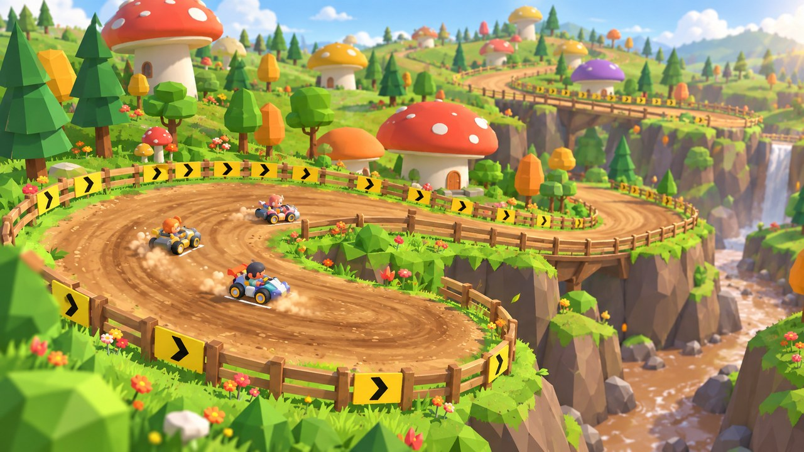
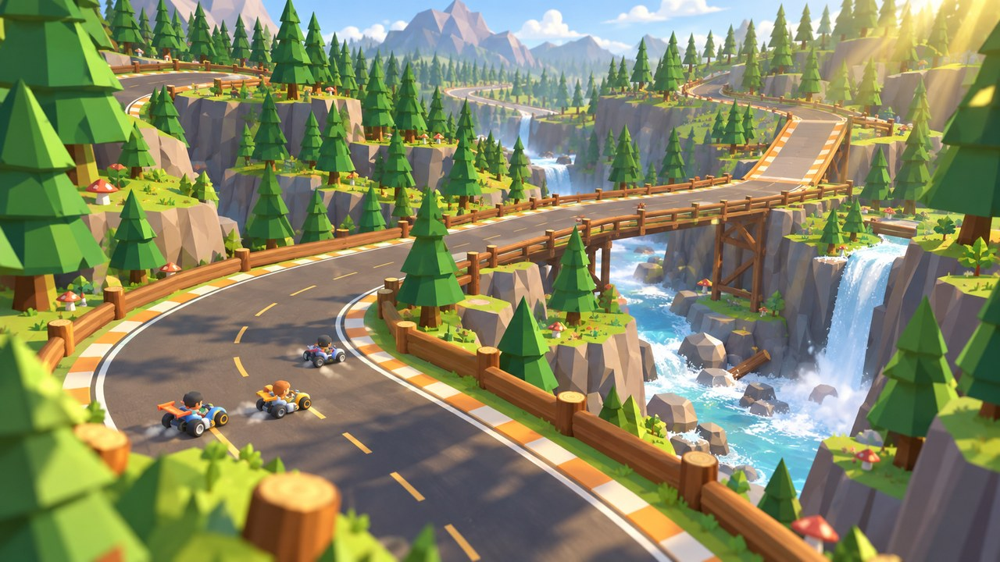
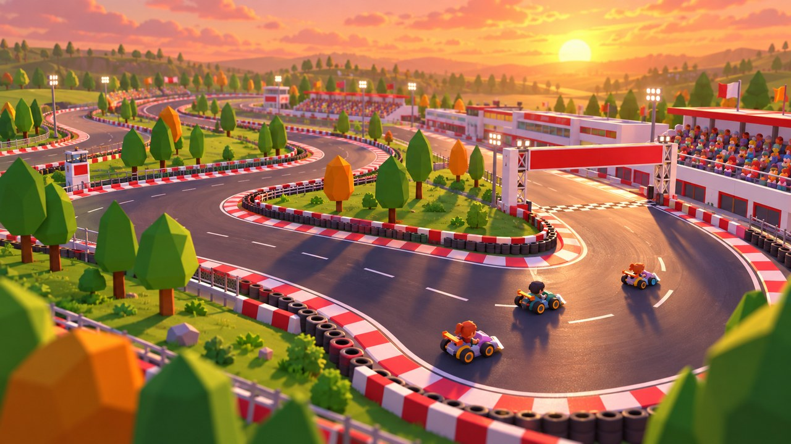
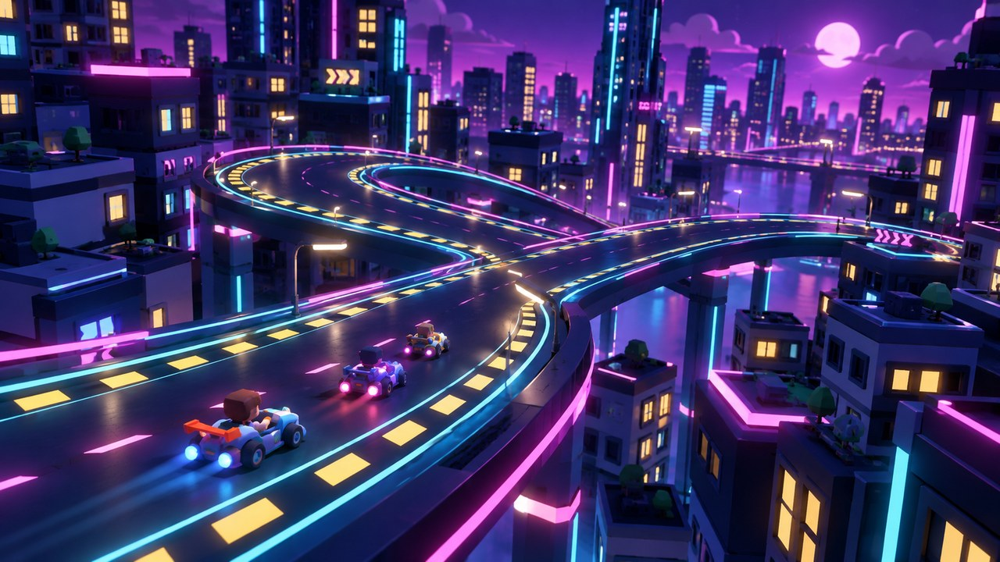

<p align="center">
  <a href="README.md"></a>
  <a href="README.zh-CN.md"></a>
</p>

<p align="center">
  
</p>

<p align="center">
  仿照跑跑卡丁车的 3D 卡丁车竞速游戏，用 Godot 4.7 制作：漂移、集气、氮气、瞬间加速（小喷）、起步加速、尾流、跳台飞跃、道具战，以及电视转播式的精彩回放。
</p>

> [!IMPORTANT]
> **本项目全程由 Claude Opus 5.5 制作。** 全部代码、赛道与场景、玩法与手感调校、界面、音效与音乐合成、测试和打包，都是 Anthropic 的 Claude Opus 5.5 在 Claude Code 里完成的。
>
> **图片素材由 Opus 5.5 调用 OpenAI GPT Image（gpt-image-2.5）生成**，包括 Logo、App 图标、道具图标、奖杯、赛道插画、首页大图、菜单背景和赛道边的广告牌。
>
> 需求、试玩与反馈：**bilibili @铂金小鸟**。3D 模型（Kenney）和字体是开源素材，见[许可与素材](#许可与素材)。

<p align="center">
  
</p>

## 运行

- **直接玩（不需要装 Godot）**：到 GitHub 的 **Releases** 页面下载 macOS 版（Intel / Apple 芯片通用）或 Windows 版。也可以按下文「[开发](#开发)」自己导出。
- **从源码运行**：安装 Godot 4.7（`brew install --cask godot`）后在终端运行 `godot --path .`（macOS 上也可以直接双击 `start-macos.command`），或用 Godot 编辑器打开项目后按 F5。
- **首次启动**：每台电脑第一次启动时要编译 3D 着色器（可能要 1～2 分钟，Intel Mac 上最慢），期间会显示「正在准备 3D 图形」，之后启动就很快了。
- **语言**：支持中文和英文。简体中文系统默认中文，其他系统默认英文，设置里可以随时切换。

## 内容

- **4 种模式**：
  - 竞速赛：漂移集气放氮气。
  - 道具赛：10 种道具。
  - 计时赛：最佳一局保存为幽灵车，实时显示差距。
  - 大奖赛：新星杯和疾风杯各 4 场，积分制。
- **8 条赛道**，从入门到高难，见下文。
  - 森林发卡有没有护栏的悬崖路，掉下去只能走崖下小路绕回主路，另外还有山顶近道。
- **赛车与车手**：
  - 5 款赛车，极速、加速、操控、漂移、氮气、重量各不相同。
  - 12 位车手，5 种涂装。
- **对手**：7 位 AI，简单、普通、困难三档，可选 1、3、5 圈。
- **道具**：氮气、导弹、水炸弹、香蕉皮、天使护盾、乌云、磁铁、雷暴、飞碟、水苍蝇，按名次加权发放。
- **完整流程**：标题 → 主菜单 → 赛前设置 → 加载 → 开场航拍 → 倒计时 → 比赛 → 冲线 → 3D 颁奖台结算 → 精彩回放 / 再来一局 / 下一赛道。
  - 赛前设置有 3D 车库实时预览、车手头像和赛道卡片。
  - 另有暂停菜单、最佳纪录、操作说明与道具图鉴。
  - 设置里可以调音量、画质、全屏、垂直同步、视角、自动小喷、显示 FPS 和语言。
- **8 个主题场景**：
  - 风车小镇、彩色城镇、金字塔沙漠、积雪松林、巨型蘑菇森林、河谷瀑布、赛车场、霓虹夜城。
  - 急弯外侧有指示牌。
  - 天气效果：落叶、沙尘、飘雪、萤火虫。
- **特效**：
  - 漂移烟与胎痕；白 → 蓝的漂移火花，提示可以小喷。
  - 氮气尾焰、尾流风线、爆炸冲击波。
  - 护盾、水泡、飞碟、乌云等状态特效。
  - 速度线与氮气径向模糊。
- **精彩回放**：
  - 电视转播、追尾、环绕、俯瞰机位，自动导播。
  - 可变速、暂停、切换焦点车，一键隐藏界面，方便录视频。
- **音频**：全部音效和 10 首 BGM（每条赛道一首，加上菜单和结算）都是离线合成的。

## 赛道

| | | | |
|:---:|:---:|:---:|:---:|
| <br>**阳光小镇** ★ | <br>**城镇手指** ★★ | <br>**黄金沙漠** ★★ | <br>**冰雪乐园** ★★ |
| <br>**森林发卡** ★★★ | <br>**森林峡谷** ★★ | <br>**疾风赛车场** ★★ | <br>**霓虹夜城** ★★★ |

- **阳光小镇**：风车与红顶小屋之间的宽阔环线，适合练习漂移。
- **城镇手指**：像手掌一样来回折返的城镇街道，连续发卡弯考验漂移。
- **黄金沙漠**：穿越金字塔的起伏沙丘，两处跳台可以飞越。
- **冰雪乐园**：雪松林中的冰面赛道，抓地力更低，漂移更滑。
- **森林发卡**：蘑菇森林里的窄土路：六连急发卡、没有护栏的悬崖路（掉下去只能走崖下小路绕回）、泥泞谷底、桥下穿行、山顶近道。
- **森林峡谷**：穿过巨木与峭壁的山路，大跳台飞越河流。
- **疾风赛车场**：夕阳下的正规赛车场，两条长直道和一个发卡弯。
- **霓虹夜城**：霓虹楼宇间的 8 字立交，窄路连弯，考验走线。

新星杯：阳光小镇、城镇手指、黄金沙漠、冰雪乐园。疾风杯：森林发卡、疾风赛车场、森林峡谷、霓虹夜城。

## 操作

| 动作 | 键盘 | 手柄 |
|---|---|---|
| 加速 / 刹车·倒车 | ↑ ↓ 或 W S | RT / LT |
| 转向 | ← → 或 A D | 左摇杆 / 十字键 |
| 漂移 | Shift 或 J | B / RB / LB |
| 氮气 / 道具 | 空格 或 K | A |
| 交换道具 | Q 或 E | X |
| 复位 | R | Y |
| 切换视角 | C | Back |
| 暂停 | Esc 或 P | Start |
| 隐藏 HUD | H | — |
| 静音 | M | — |
| 全屏 | F11 | — |

技巧：
- **瞬间加速（小喷）**：漂移超过 0.35 秒后松开 Shift，屏幕出现「↑」时松开再按一次 ↑。设置里可以开「自动小喷」。
- **起步加速**：倒计时 GO 出现前 0.35 秒内或 GO 之后 0.3 秒内第一次按下 ↑；在最后 1 秒里按早了会抢跑打滑。
- **尾流**：紧跟前车（正后方 3–14 米）约 1 秒会获得一次尾流加速。

回放操作：1–4 切换机位（0 自动导播）、← → 切换焦点车、空格暂停、[ ] 变速、H 隐藏界面、Esc 退出。

## 开发

```bash
godot --headless --path . --import                 # 首次导入素材
godot --headless --path . -s tests/run_tests.gd    # 全部自动化测试（退出码 = 失败数）
godot --headless --path . -s tests/tools/sim_race.gd -- --track=all --mode=speed   # 无界面整场 AI 比赛
godot --headless --path . -s tests/tools/handling.gd      # 每款车的操控数据
godot --headless --path . -s tests/tools/keyboard_bot.gd  # 模拟键盘玩家跑完所有赛道
python3 tools/gen_audio.py                                # 重新合成全部音效与音乐

# 调试 / 截图 / 演示：直接开一场无人驾驶的比赛并定时截图（加 --then-replay 可在冲线后直接进入回放）
godot --path . --fixed-fps 60 -- --race=forest --mode=item --autopilot --shots=5,20 --out=/tmp/shots --quit-after=21 --size=1920x1080
# 打开某个菜单页面截图；或自动操作跑完整流程（smoke / pause / gp）
godot --path . -- --menu=setup --shots=2 --out=/tmp/shots --quit-after=3
godot --path . -- --flow=gp
godot --path . --fixed-fps 60 -s tests/tools/fx_gallery.gd -- --out=/tmp/fx   # 特效画廊

# 导出（需要先安装 4.7.2 导出模板；不要加 --headless，否则不会预烘焙着色器）
godot --path . --export-release "macOS" build/macos/GaleKart.zip
godot --path . --export-release "Windows" build/windows/GaleKart.exe
```

项目结构：
- `src/sim/`：与渲染无关的仿真层（120 Hz 固定子步，可无界面运行）。
- `src/view/`：3D 表现层。
- `src/race/`：比赛总控、事件分发与回放。
- `src/ui/`：HUD 与菜单。
- `src/i18n/`：中英文文本。
- `src/autoload/`：全局流程、存档、音频。

设计文档见 `docs/superpowers/specs/2026-09-26-gale-kart-godot-design.md`。

## 许可与素材

- **代码**：MIT，见 [`LICENSE`](LICENSE)。
- **图片素材**（Logo、图标、插画、背景、广告牌）：由 Claude Opus 5.5 调用 OpenAI GPT Image 生成，再用 `tools/` 里的脚本抠图、合成。
- **3D 模型**：[Kenney](https://kenney.nl)（CC0），见 `assets/models/LICENSE-Kenney.txt`。
- **字体**：ZCOOL KuaiLe 与 Bungee（SIL OFL 1.1），见 `assets/fonts/`。
- **音效与音乐**：由 `tools/gen_audio.py` 离线合成。
- **不在 MIT 授权范围内**：作者头像与个人推广素材（`assets/ui/creator/`、`assets/textures/ads/*creator*`）。
